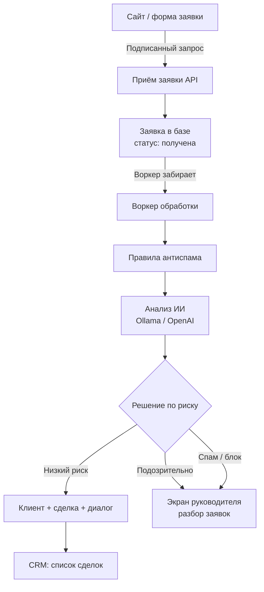
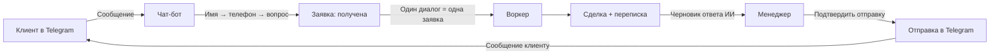
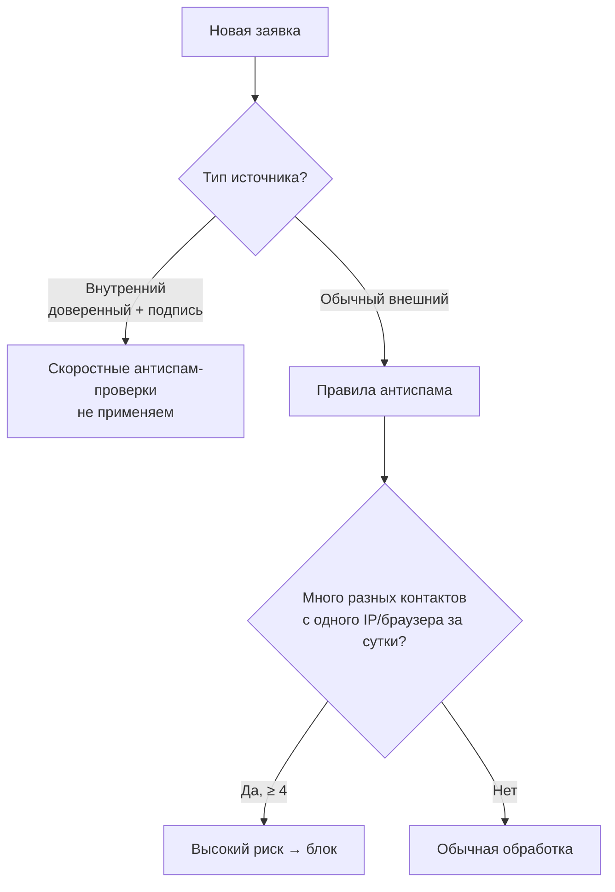

# Архитектура

## Обзор

Smart-crm-antispam — modular monolith на Django. Пять Django-приложений в одном процессе; воркер и Telegram-бот запускаются отдельными процессами.

## Приложения

| Приложение | Назначение |
|-----------|-----------|
| `crm` | Пользователи, роли, клиенты, сделки, воронка, комментарии, API |
| `intake` | Приём заявок (webhook/форма), rate limit, risk scoring, Admin Ops |
| `ai` | AI-анализ (Ollama/OpenAI), prompt builder, knowledge retrieval |
| `bot` | Telegram customer chat-bot (aiogram FSM), настройки |
| `channels` | Channel adapters (site mock, Telegram), Dialog/Message/DeliveryLog |

## Процессы

```
python manage.py runserver       # CRM UI + API (обязательный)
python manage.py process_inbound # воркер заявок (обязательный)
python manage.py run_admin_bot   # Telegram chat-bot (опциональный)
```

## Основной поток: заявка → CRM

1. PHP-сайт или форма `/lead/` отправляет подписанный POST на `/api/v1/intake/lead`
2. `InboundRequest` создаётся со статусом `received`; rate limit, honeypot, HMAC проверяются немедленно
3. Worker (`process_inbound`) подхватывает `received`-заявки атомарным UPDATE
4. `evaluate_rules()` считает детерминированный risk score (0–100)
5. `process_request_with_ai()` вызывает Ollama/OpenAI; итоговый score = `max(rules, ai)`
6. `decision_for_score()` выбирает: process / risk_flagged / suspicious / blocked
7. Создаётся Client + Deal + Dialog — или заявка уходит в suspicious/blocked без сделки

## Два контура

| | Admin Ops (CRM UI) | Customer Messaging |
|---|---|---|
| Кто видит | head only | manager (свои диалоги) |
| Что | заявки, риск, модерация, retry | переписка с клиентами |
| URL | `/requests/` | `/deals/{id}/` (чат-блок) |

## Схема: заявка → воркер → CRM



## Схема: клиент в Telegram



## Антиспам: отпечаток IP / браузера



## Архитектурные решения

Подробнее: [decisions/](decisions/)

- **D-008**: Admin Ops = CRM UI для head; Telegram — optional transport
- **D-009**: Messaging отделён от Admin Ops
- **D-029**: trust_level для server-to-server
- **D-030**: Webhook-секрет ротируется через UI
