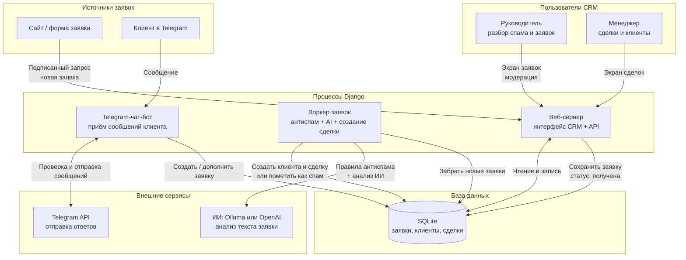

# Общая архитектура

Схема: откуда приходят заявки, кто их обрабатывает и куда попадают данные.

## Как читать схему

1. **Сайт или Telegram** присылают обращение.
2. **Веб-сервер** принимает заявку и кладёт в базу.
3. **Воркер** проверяет на спам, при необходимости зовёт **ИИ**, потом создаёт сделку или блокирует заявку.
4. **Руководитель** видит подозрительные заявки в Admin Ops.
5. **Менеджер** работает с нормальными сделками в CRM.

## Процессы

| Команда | Обязателен | Зачем |
|---------|-----------|--------|
| `python manage.py runserver` | да | Интерфейс CRM и API приёма заявок |
| `python manage.py process_inbound` | да | Воркер: антиспам, AI, создание сделок |
| `python manage.py run_admin_bot` | нет | Telegram-чат-бот для клиентов |
