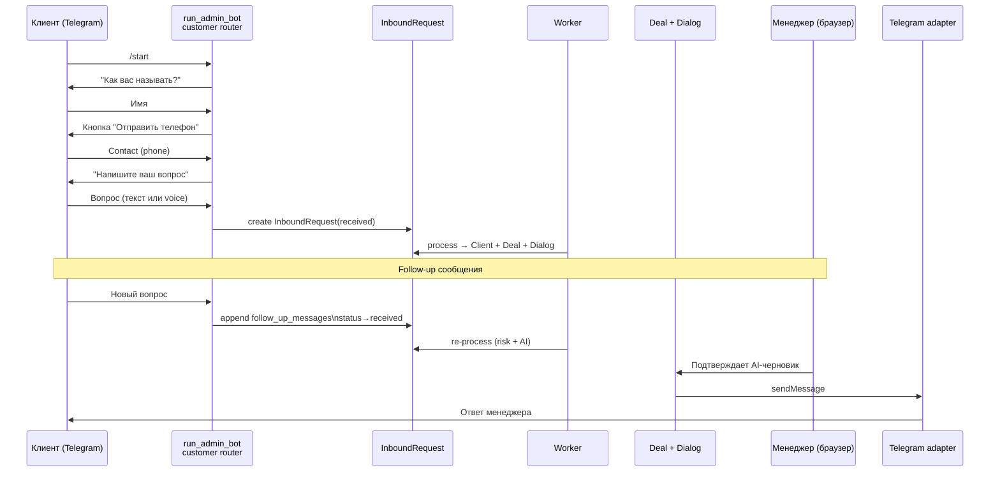

# Messaging & Telegram Bot

## Customer messaging flow



## Admin commands (head only)

```mermaid
graph LR
    HEAD[Head Telegram] -->|X-Intake-Trust: internal + HMAC| MIDDLEWARE[AdminAccessMiddleware\nallowlist]
    MIDDLEWARE -->|pass| COMMANDS[/recent /errors /retry /stats]
    MIDDLEWARE -->|deny| SILENT[silent ignore]
    COMMANDS -->|ORM read| DB[(SQLite)]
    DB -->|без PII| HEAD
```

## Два router-а в одном процессе

```
run_admin_bot
├── admin_router  (AdminAccessMiddleware)
│   ├── /recent, /errors, /retry <id>, /open <id>, /stats
│   └── allowlist: BotSettings.admin_chat_id + admin_telegram_ids
└── customer_router (без middleware)
    ├── FSM: LeadFlow (waiting_name → waiting_phone → waiting_question)
    └── fallback handler → create_request_from_known_customer()
```

## Moderation gate

Перед каждым ответом проверяется `telegram_customer_is_blocked()`:
- Последний InboundRequest thread `blocked`
- `Deal.is_spam=True`
- Blocklist по phone/IP/email

Заблокированный клиент не получает никакого ответа, новые записи не создаются.
