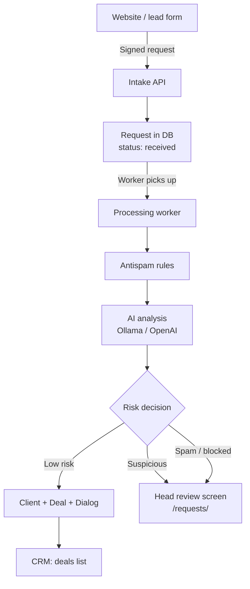
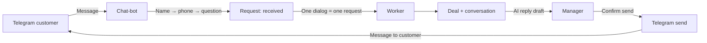
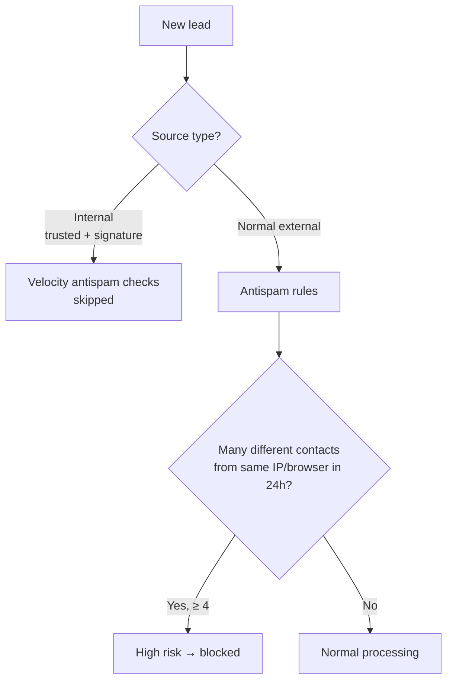

# Architecture

## Overview

Smart-crm-antispam is a Django modular monolith. Five Django apps run in one web process; the worker and Telegram bot run as separate processes.

## Apps

| App | Purpose |
|-----|---------|
| `crm` | Users, roles, clients, deals, pipeline, comments, API |
| `intake` | Lead intake (webhook/form), rate limit, risk scoring, Admin Ops |
| `ai` | AI analysis (Ollama/OpenAI), prompt builder, knowledge retrieval |
| `bot` | Telegram customer chat-bot (aiogram FSM), settings |
| `channels` | Channel adapters (site mock, Telegram), Dialog/Message/DeliveryLog |

## Processes

```
python manage.py runserver       # CRM UI + API (required)
python manage.py process_inbound # inbound worker (required)
python manage.py run_admin_bot   # Telegram chat-bot (optional)
```

## Main flow: lead → CRM

1. A PHP site or `/lead/` form sends a signed POST to `/api/v1/intake/lead`
2. An `InboundRequest` is created with status `received`; rate limit, honeypot, and HMAC are checked immediately
3. The worker (`process_inbound`) picks up `received` requests with an atomic UPDATE
4. `evaluate_rules()` computes a deterministic risk score (0–100)
5. `process_request_with_ai()` calls Ollama/OpenAI; final score = `max(rules, ai)`
6. `decision_for_score()` chooses: process / risk_flagged / suspicious / blocked
7. Client + Deal + Dialog are created — or the request goes to suspicious/blocked without a deal

## Two contours

| | Admin Ops (CRM UI) | Customer Messaging |
|---|---|---|
| Who sees it | head only | manager (own dialogs) |
| What | requests, risk, moderation, retry | customer conversations |
| URL | `/requests/` | `/deals/{id}/` (chat block) |

## Diagram: lead → worker → CRM



## Diagram: Telegram customer



## Antispam: IP / browser fingerprint



## Architecture decisions

Details: [decisions/](decisions/)

- **D-008**: Admin Ops = CRM UI for head; Telegram is optional transport
- **D-009**: Messaging is separated from Admin Ops
- **D-029**: `trust_level` for server-to-server intake
- **D-030**: Webhook secret is rotated via UI
