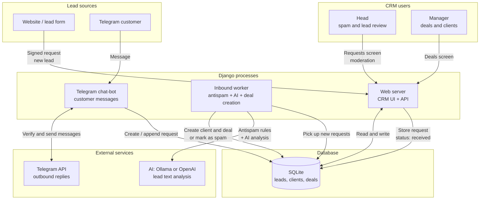

# System architecture

Diagram: where leads come from, who processes them, and where data goes.

## How to read the diagram

1. **Website or Telegram** sends an inquiry.
2. The **web server** accepts the lead and stores it in the database.
3. The **worker** checks for spam, may call **AI**, then creates a deal or blocks the request.
4. The **head** reviews suspicious requests in Admin Ops.
5. The **manager** works with normal deals in CRM.

## Processes

| Command | Required | Purpose |
|---------|----------|---------|
| `python manage.py runserver` | yes | CRM UI and intake API |
| `python manage.py process_inbound` | yes | Worker: antispam, AI, deal creation |
| `python manage.py run_admin_bot` | no | Telegram chat-bot for customers |
