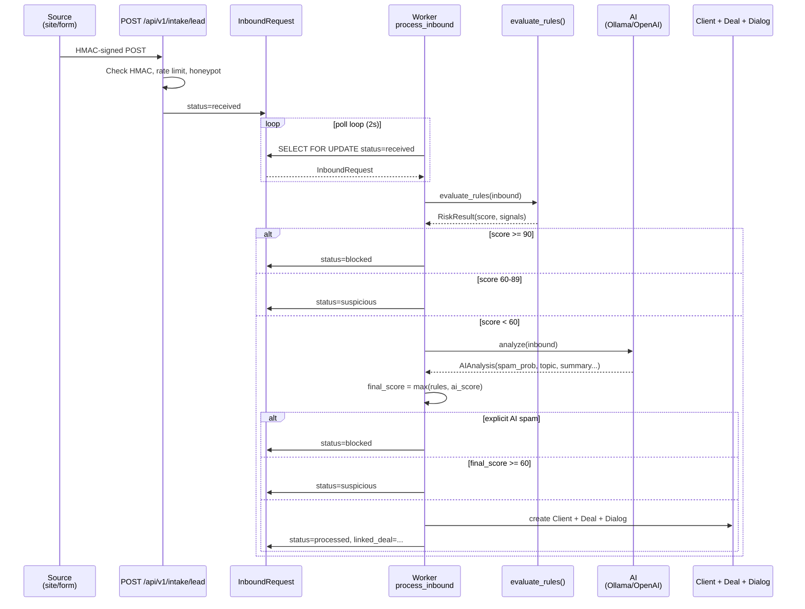
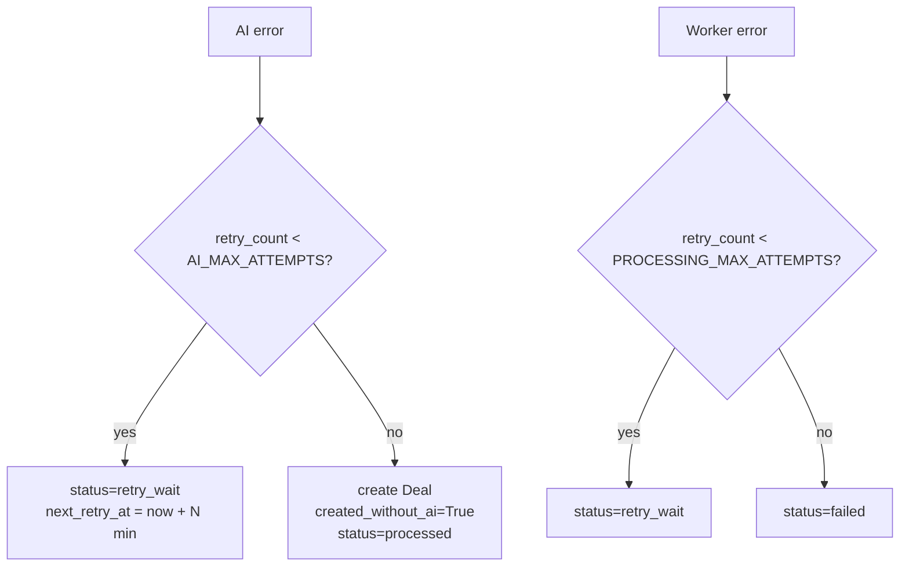

# Intake → Worker → AI → CRM

Inbound lead processing from accept to CRM entity creation.

```mermaid
sequenceDiagram
    participant SRC as Source<br/>(site/form)
    participant API as POST /api/v1/intake/lead
    participant DB as InboundRequest
    participant W as Worker<br/>process_inbound
    participant RISK as evaluate_rules()
    participant AI as AI<br/>(Ollama/OpenAI)
    participant CRM as Client + Deal + Dialog

    SRC->>API: HMAC-signed POST
    API->>API: Check HMAC, rate limit, honeypot
    API->>DB: status=received
    
    loop poll loop (2s)
        W->>DB: SELECT FOR UPDATE status=received
        DB-->>W: InboundRequest
    end
    
    W->>RISK: evaluate_rules(inbound)
    RISK-->>W: RiskResult(score, signals)
    
    alt score >= 90
        W->>DB: status=blocked
    else score 60-89
        W->>DB: status=suspicious
    else score < 60
        W->>AI: analyze(inbound)
        AI-->>W: AIAnalysis(spam_prob, topic, summary...)
        W->>W: final_score = max(rules, ai_score)
        alt explicit AI spam
            W->>DB: status=blocked
        else final_score >= 60
            W->>DB: status=suspicious
        else
            W->>CRM: create Client + Deal + Dialog
            W->>DB: status=processed, linked_deal=...
        end
    end
```

## Retry / fallback

```mermaid
graph TD
    A[AI error] --> B{retry_count < AI_MAX_ATTEMPTS?}
    B -->|yes| C[status=retry_wait\nnext_retry_at = now + N min]
    B -->|no| D[create Deal\ncreated_without_ai=True\nstatus=processed]
    
    E[Worker error] --> F{retry_count < PROCESSING_MAX_ATTEMPTS?}
    F -->|yes| G[status=retry_wait]
    F -->|no| H[status=failed]
```
