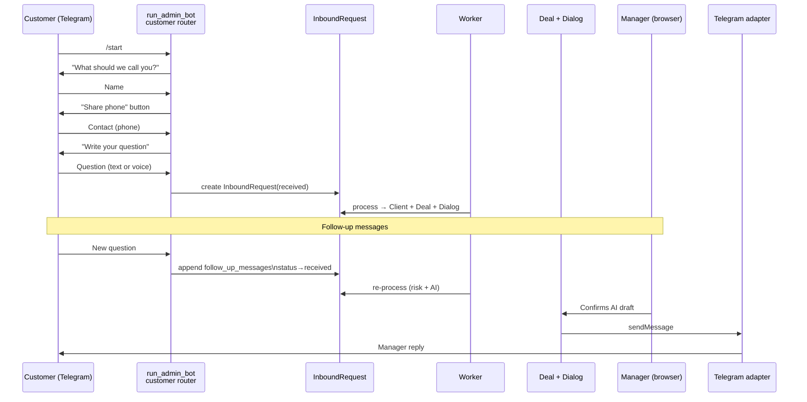

# Messaging & Telegram Bot

## Customer messaging flow



## Admin commands (head only)

```mermaid
graph LR
    HEAD[Head Telegram] -->|allowlist| MIDDLEWARE[AdminAccessMiddleware\nallowlist]
    MIDDLEWARE -->|pass| COMMANDS[/recent /errors /retry /stats]
    MIDDLEWARE -->|deny| SILENT[silent ignore]
    COMMANDS -->|ORM read| DB[(SQLite)]
    DB -->|no PII| HEAD
```

## Two routers in one process

```
run_admin_bot
├── admin_router  (AdminAccessMiddleware)
│   ├── /recent, /errors, /retry <id>, /open <id>, /stats
│   └── allowlist: BotSettings.admin_chat_id + admin_telegram_ids
└── customer_router (no middleware)
    ├── FSM: LeadFlow (waiting_name → waiting_phone → waiting_question)
    └── fallback handler → create_request_from_known_customer()
```

## Moderation gate

Before every reply, `telegram_customer_is_blocked()` is checked:
- Latest InboundRequest thread is `blocked`
- `Deal.is_spam=True`
- Blocklist by phone/IP/email

A blocked customer gets no reply and no new records are created.
